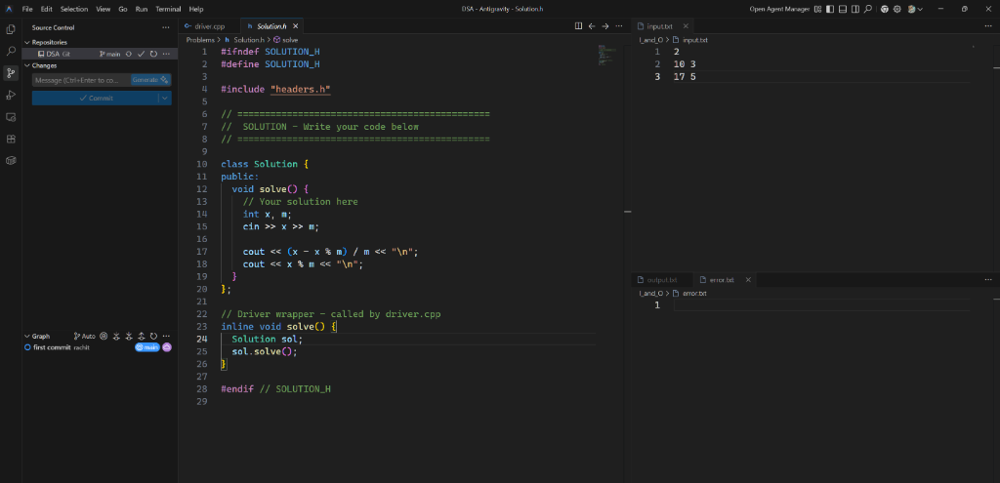

# DSA - Competitive Programming Template

A streamlined C++ setup for **Data Structures & Algorithms** practice and **Competitive Programming** contests (Codeforces, CodeChef, AtCoder, LeetCode).



---

## Features

- **Ready-to-use template** with common utilities and data structures
- **Compiler optimizations** via GCC pragmas (O3, AVX2, loop unrolling)
- **Fast I/O** optimized for competitive programming
- **Built-in data structures**: DSU, Segment Tree, Fenwick Tree
- **Math utilities**: Modular arithmetic, nCr, GCD/LCM, Prime sieve
- **Graph algorithms**: BFS, DFS, adjacency list helpers
- **Debug utilities**: Pretty print vectors, maps, sets, pairs
- **File-based I/O**: Input from `input.txt`, output to `output.txt`

---

## Project Structure

```
DSA/
├── driver.cpp              # Main entry point
├── Problems/
│   ├── headers.h           # All utilities & data structures
│   └── Solution.h          # Your solution code goes here
├── I_and_O/
│   ├── input.txt           # Test input
│   ├── output.txt          # Program output
│   └── error.txt           # Debug/error output
└── TimeSpace/
    ├── Time.h              # Time measurement utilities
    └── Space.h             # Space analysis utilities
```

---

## Quick Start

### 1. Write Your Solution

Edit `Problems/Solution.h` and implement your logic inside the `Solution::solve()` method:

```cpp
class Solution {
public:
    void solve() {
        // Your solution here
        int n;
        cin >> n;
        cout << n * 2 << "\n";
    }
};
```

### 2. Add Test Cases

Put your input in `I_and_O/input.txt`:

```
2
10 3
17 5
```

### 3. Compile & Run

```bash
# Compile
g++ driver.cpp -o driver -std=c++17

# Run
./driver      # Linux/Mac
.\driver.exe  # Windows
```

### 4. Check Output

Your results will be in `I_and_O/output.txt`. Debug output goes to `I_and_O/error.txt`.

---

## Available Utilities

### Type Definitions
```cpp
ll, ld, ull           // long long, long double, unsigned long long
vi, vll, vvi, vvll    // vector<int>, vector<ll>, etc.
pii, pll              // pair<int,int>, pair<ll,ll>
mii, mll, si, sl      // map and set variants
```

### Common Macros
```cpp
all(x)                // x.begin(), x.end()
rall(x)               // x.rbegin(), x.rend()
pb, mp, fi, se        // push_back, make_pair, first, second
sz(x)                 // (int)(x).size()
rep(i, a, b)          // for(int i = a; i < b; i++)
fore(x, v)            // for(auto &x : v)
```

### Math Functions
```cpp
gcd(a, b), lcm(a, b)          // GCD and LCM
power(x, y, mod)              // Fast modular exponentiation
modInv(x, mod)                // Modular inverse
nCr(n, r, mod)                // Binomial coefficient
```

### Bit Manipulation
```cpp
setBit(n, i), clearBit(n, i), toggleBit(n, i), checkBit(n, i)
countSetBits(n), trailingZeros(n), leadingZeros(n)
```

### Data Structures
```cpp
DSU(n)                        // Disjoint Set Union
FenwickTree(n)                // Binary Indexed Tree
SegmentTree(n)                // Segment Tree with sum queries
```

### Graph Utilities
```cpp
addEdge(adj, u, v, directed)  // Add edge to adjacency list
bfs(adj, start)               // BFS returning distances
dfs(adj, u, visited)          // DFS traversal
```

### Debug (only works locally)
```cpp
debug(x)                      // Prints: x = <value>
// Works with int, ll, string, vector, set, map, pair
```

---

## Compiler Optimizations

The template includes GCC pragmas for maximum performance on online judges:

```cpp
#pragma GCC optimize("O2")           // O2 optimization level
#pragma GCC optimize("O3")           // O3 aggressive optimization
#pragma GCC optimize("unroll-loops") // Loop unrolling
#pragma GCC optimize("fast-math")    // Fast floating-point (use with caution)
#pragma GCC optimize("inline")       // Aggressive function inlining

#pragma GCC target("avx2")           // AVX2 SIMD instructions
#pragma GCC target("bmi")            // Bit manipulation instructions
#pragma GCC target("bmi2")           // More bit manipulation
#pragma GCC target("popcnt")         // Population count instruction
#pragma GCC target("lzcnt")          // Leading zero count
```

### When to Use

| Optimization | Best For | Caution |
|--------------|----------|---------|
| `O3` | General performance | Safe for most problems |
| `unroll-loops` | Tight loops, array operations | May increase binary size |
| `fast-math` | Heavy floating-point math | May affect precision |
| `avx2` | SIMD-friendly operations | Check judge compatibility |

> **Note**: These pragmas are ignored on Windows/Clang locally but work on Codeforces, AtCoder, and most online judges that use GCC.

---

## Contest Workflow

1. **Before contest**: Have the template ready
2. **During contest**: 
   - Copy problem input to `I_and_O/input.txt`
   - Implement solution in `Problems/Solution.h`
   - Compile and test locally
3. **Submission**: Copy the contents of `Solution.h` along with `headers.h` content

---

##  Configuration

### Single Test Case
Comment out the `cin >> t;` line in `driver.cpp`:

```cpp
int t = 1;
// cin >> t;  // Comment this for single test case
```

### Multiple Test Cases (default)
```cpp
int t = 1;
cin >> t;  // Reads number of test cases
```

---

## Compilation Options

```bash
# Standard compilation
g++ driver.cpp -o driver -std=c++17

# With optimizations (for performance testing)
g++ driver.cpp -o driver -std=c++17 -O2

# With warnings (recommended during development)
g++ driver.cpp -o driver -std=c++17 -Wall -Wextra

# With debug symbols
g++ driver.cpp -o driver -std=c++17 -g -DLOCAL
```

---

## Constants

| Constant | Value | Usage |
|----------|-------|-------|
| `MOD` | 10⁹ + 7 | Standard modulo |
| `MOD2` | 998244353 | NTT-friendly modulo |
| `INF` | 10¹⁸ | Large value for long long |
| `NINF` | INT_MIN | Negative infinity |
| `MAXN` | 2×10⁵ + 5 | Common array size |
| `PI` | acos(-1.0) | Pi constant |
| `EPS` | 10⁻⁹ | Epsilon for floating point |

---

## Contributing

Feel free to add more utilities or optimize existing ones!

---

## License

MIT License - Use freely for your competitive programming journey!

---

**Happy Coding! -**
