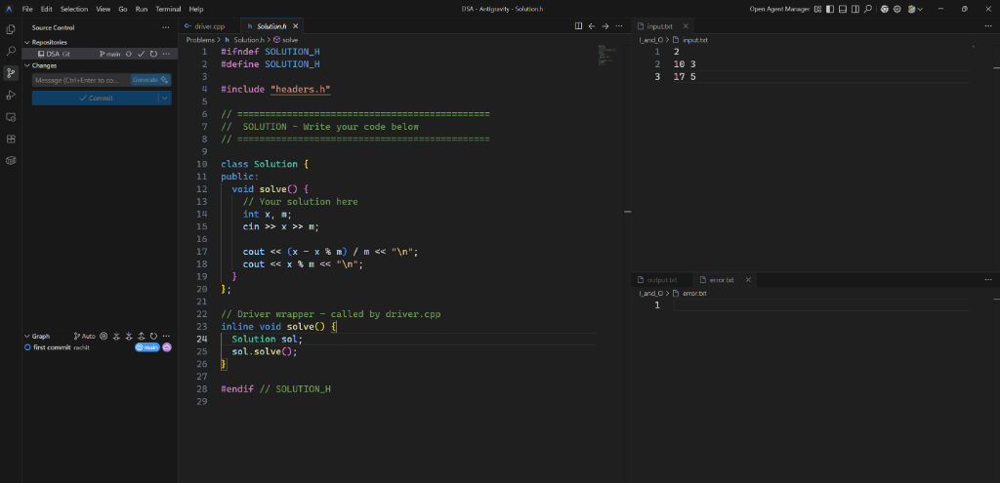

# 🚀 Competitive Programming Template

<div align="center">


**The Ultimate C++ Library for Competitive Programming**

*Codeforces • CodeChef • AtCoder • LeetCode • ICPC*



</div>

---

## ⚡ What Is This?

This is a **plug-and-play C++ template** that gives you instant access to:

- ✅ **40+ Pre-built Algorithms** (Graphs, Strings, DP, Math, Geometry)
- ✅ **Optimized Data Structures** (Segment Tree, Fenwick Tree, DSU, Trie, Sparse Table)
- ✅ **Time & Space Analysis** (Built-in profiling tools)
- ✅ **Debug Utilities** (Pretty-print any data structure)
- ✅ **Compiler Optimizations** (O3, AVX2, loop unrolling)

**No more rewriting the same algorithms!** Just include and code. 🎯

---

## 📁 Project Structure

```
📦 Competitive_Programming_Template/
├── 📄 driver.cpp              ← Entry point (runs your solution)
├── 📂 Problems/
│   ├── 📄 headers.h           ← 🔥 THE ALGORITHM LIBRARY (40+ algorithms!)
│   └── 📄 Solution.h          ← ✍️ YOUR CODE GOES HERE
├── 📂 I_and_O/
│   ├── 📄 input.txt           ← Test input
│   ├── 📄 output.txt          ← Your program's output
│   └── 📄 error.txt           ← Debug output + Time/Space stats
└── 📂 TimeSpace/
    ├── 📄 Time.h              ← Execution time measurement
    └── 📄 Space.h             ← Memory usage analysis
```

---

## 🚦 Quick Start (3 Steps!)

### Step 1️⃣: Write Your Solution

Open `Problems/Solution.h` and implement your logic:

```cpp
class Solution {
public:
    void solve() {
        TimeSpace::ScopedTimer timer("Solution");  // Auto-times your code!
        
        int n;
        cin >> n;
        vi arr(n);  // vi = vector<int>
        read(arr);  // Built-in read function!
        
        // Example: Find LIS length
        cout << lisLength(arr) << "\n";
    }
};
```

### Step 2️⃣: Add Test Cases

Put your input in `I_and_O/input.txt`:

```
1
5
3 1 4 1 5
```

### Step 3️⃣: Compile & Run

```bash
# Compile
g++ driver.cpp -o driver -std=c++17

# Run
./driver         # Linux/Mac
.\driver.exe     # Windows
```

**That's it!** Check `I_and_O/output.txt` for results and `I_and_O/error.txt` for timing stats. ✨

---

## 📚 Algorithm Library Reference

### 🔤 String Algorithms

| Algorithm | Function | Time Complexity |
|-----------|----------|-----------------|
| **KMP Pattern Matching** | `kmpSearch(text, pattern)` | O(n + m) |
| **Z-Function** | `zFunction(s)` | O(n) |
| **Rabin-Karp Hash** | `RollingHash(s)` | O(n) |
| **Manacher (Palindromes)** | `manacher(s)` | O(n) |
| **Longest Palindrome** | `longestPalindrome(s)` | O(n) |
| **Trie** | `Trie()` class | O(L) per operation |
| **Suffix Array** | `suffixArray(s)` | O(n log n) |

<details>
<summary><b>📝 Example: Find all pattern occurrences</b></summary>

```cpp
string text = "ababcabab";
string pattern = "ab";
vi matches = kmpSearch(text, pattern);
// matches = [0, 2, 5, 7] (starting positions)
```
</details>

---

### 🌐 Graph Algorithms

| Algorithm | Function | Time Complexity |
|-----------|----------|-----------------|
| **BFS** | `bfs(adj, start)` | O(V + E) |
| **DFS** | `dfs(adj, u, visited)` | O(V + E) |
| **0-1 BFS** | `bfs01(adj, start)` | O(V + E) |
| **Dijkstra** | `dijkstra(adj, start)` | O(E log V) |
| **Bellman-Ford** | `bellmanFord(n, edges, start)` | O(V × E) |
| **Floyd-Warshall** | `floydWarshall(n, edges)` | O(V³) |
| **Topological Sort** | `topoSort(adj)` | O(V + E) |
| **LCA (Binary Lifting)** | `LCA(adj, root)` class | O(log n) query |
| **Tarjan SCC** | `TarjanSCC(adj)` class | O(V + E) |
| **Bridges & APs** | `BridgesAP(adj)` class | O(V + E) |

<details>
<summary><b>📝 Example: Shortest path with Dijkstra</b></summary>

```cpp
int n = 5;
vector<vector<pll>> adj(n);  // {neighbor, weight}
adj[0].pb({1, 10});
adj[0].pb({2, 3});
adj[1].pb({2, 1});
// ...

vll dist = dijkstra(adj, 0);
// dist[i] = shortest distance from 0 to i
```
</details>

---

### 🔢 Number Theory

| Algorithm | Function | Time Complexity |
|-----------|----------|-----------------|
| **GCD / LCM** | `gcd(a, b)`, `lcm(a, b)` | O(log min(a,b)) |
| **Extended GCD** | `extgcd(a, b, x, y)` | O(log min(a,b)) |
| **Modular Exponentiation** | `power(x, y, mod)` | O(log y) |
| **Modular Inverse** | `modInv(x, mod)` | O(log mod) |
| **nCr (Binomial)** | `nCr(n, r, mod)` | O(r) |
| **Fast nCr** | `nCrFast(n, r, fact, invFact)` | O(1) |
| **Euler Totient** | `eulerTotient(n)` | O(√n) |
| **CRT** | `crt(r1, m1, r2, m2)` | O(log m) |
| **Miller-Rabin Primality** | `isPrime(n)` | O(k log³n) |
| **Pollard Rho Factorization** | `factorize(n)` | O(n^¼) |
| **Sieve of Eratosthenes** | `sieve(n)` | O(n log log n) |
| **Linear Sieve** | `linearSieve(n)` | O(n) |

<details>
<summary><b>📝 Example: Fast primality test</b></summary>

```cpp
if (isPrime(1000000007)) {
    cout << "It's prime!\n";
}

// Factorize a number
vector<ll> factors = factorize(123456789);
// factors = [3, 3, 3607, 3803]
```
</details>

---

### 📊 Data Structures

| Structure | Class | Key Operations |
|-----------|-------|----------------|
| **Disjoint Set Union** | `DSU(n)` | `find`, `unite`, `connected`, `getSize` |
| **Fenwick Tree** | `FenwickTree(n)` | `update`, `query`, `rangeQuery` |
| **2D Fenwick Tree** | `FenwickTree2D(n, m)` | `update`, `query`, `rangeQuery` |
| **Segment Tree** | `SegmentTree(n)` | `build`, `updateRange`, `updatePoint`, `query` |
| **Sparse Table (RMQ)** | `SparseTable(arr)` | `query` in O(1) |
| **Trie** | `Trie()` | `insert`, `search`, `startsWith`, `countPrefix` |

<details>
<summary><b>📝 Example: Range Sum Queries</b></summary>

```cpp
FenwickTree ft(100000);
ft.update(5, 10);    // Add 10 at index 5
ft.update(10, 20);   // Add 20 at index 10

ll sum = ft.rangeQuery(1, 15);  // Sum of range [1, 15]
```
</details>

---

### 🎯 Dynamic Programming

| Algorithm | Function | Time Complexity |
|-----------|----------|-----------------|
| **LIS (with reconstruction)** | `lis(arr)` | O(n log n) |
| **LIS Length Only** | `lisLength(arr)` | O(n log n) |
| **LCS** | `lcs(a, b)` | O(n × m) |
| **0/1 Knapsack** | `knapsack01(w, v, cap)` | O(n × cap) |
| **Unbounded Knapsack** | `knapsackUnbounded(w, v, cap)` | O(n × cap) |
| **Coin Change (min coins)** | `coinChange(coins, amount)` | O(n × amount) |
| **Coin Change (count ways)** | `coinChangeWays(coins, amount)` | O(n × amount) |

<details>
<summary><b>📝 Example: Longest Increasing Subsequence</b></summary>

```cpp
vi arr = {3, 1, 4, 1, 5, 9, 2, 6};
vi result = lis(arr);       // Returns actual LIS: [1, 4, 5, 6] or similar
int length = lisLength(arr); // Returns 4
```
</details>

---

### 📐 Geometry

| Function | Description |
|----------|-------------|
| `Point(x, y)` | 2D point with operators (+, -, *, /) |
| `p.dot(q)` | Dot product |
| `p.cross(q)` | Cross product |
| `p.norm()` | Euclidean distance from origin |
| `p.rotate(angle)` | Rotate point by angle (radians) |
| `dist(a, b)` | Distance between two points |
| `cross(O, A, B)` | Cross product of vectors OA and OB |
| `convexHull(points)` | Graham scan convex hull |
| `polygonArea(poly)` | Signed area of polygon |

---

### 🔢 Matrix Operations

```cpp
Matrix A(3, 3);         // 3x3 matrix
A.mat[0][0] = 1;        // Set values
Matrix I = Matrix::identity(3);  // Identity matrix
Matrix B = A * A;       // Matrix multiplication
Matrix C = A.power(10); // Matrix exponentiation
```

---

## ⏱️ Time & Space Profiling

### Measure Execution Time

```cpp
void solve() {
    TimeSpace::ScopedTimer timer("Algorithm");  // Auto-prints on scope exit
    
    // Your code here...
}
// Output in error.txt: [TIME] Algorithm: 1.2345 ms
```

### Measure Memory Usage

```cpp
vi arr(100000);
PRINT_CONTAINER(arr);
// Output: [SPACE] arr: 400.00 KB (100000 elements)

PRINT_SIZE(someVariable);
// Output: [SPACE] someVariable: 8 B
```

---

## 🛠️ Useful Macros & Types

### Type Aliases
```cpp
ll    → long long
ld    → long double
vi    → vector<int>
vll   → vector<long long>
vvi   → vector<vector<int>>
pii   → pair<int, int>
pll   → pair<long long, long long>
mii   → map<int, int>
si    → set<int>
```

### Handy Macros
```cpp
all(x)        → x.begin(), x.end()
rall(x)       → x.rbegin(), x.rend()
sz(x)         → (int)x.size()
pb            → push_back
mp            → make_pair
fi / se       → first / second
rep(i, a, b)  → for (int i = a; i < b; i++)
fore(x, v)    → for (auto &x : v)
```

### Constants
```cpp
MOD    = 1e9 + 7
MOD2   = 998244353
INF    = 1e18
PI     = 3.14159...
EPS    = 1e-9
MAXN   = 2e5 + 5
```

---

## 🐛 Debug Like a Pro

```cpp
vi arr = {1, 2, 3, 4, 5};
debug(arr);
// Output: arr = [ 1 2 3 4 5 ]

map<string, int> m = {{"a", 1}, {"b", 2}};
debug(m);
// Output: m = { {a:1} {b:2} }

pii p = {10, 20};
debug(p);
// Output: p = {10,20}
```

> 💡 **Note**: `debug()` only works locally (disabled on online judges via `ONLINE_JUDGE` macro)

---

## ⚙️ Compilation Options

```bash
# Standard (recommended)
g++ driver.cpp -o driver -std=c++17

# With optimizations
g++ driver.cpp -o driver -std=c++17 -O2

# With all warnings
g++ driver.cpp -o driver -std=c++17 -Wall -Wextra

# Debug mode
g++ driver.cpp -o driver -std=c++17 -g -DLOCAL
```

---

## 🏆 Contest Workflow

```
┌─────────────────────────────────────────────────────────────┐
│  1. READ PROBLEM                                            │
│     └── Understand input/output format                      │
│                                                             │
│  2. PASTE INPUT                                             │
│     └── Copy sample test cases to I_and_O/input.txt         │
│                                                             │
│  3. CODE SOLUTION                                           │
│     └── Write your logic in Problems/Solution.h             │
│                                                             │
│  4. COMPILE & TEST                                          │
│     └── g++ driver.cpp -o driver -std=c++17 && ./driver     │
│                                                             │
│  5. CHECK OUTPUT                                            │
│     └── Compare I_and_O/output.txt with expected            │
│                                                             │
│  6. SUBMIT                                                  │
│     └── Copy Solution.h + headers.h content to judge        │
└─────────────────────────────────────────────────────────────┘
```

---

## ❓ FAQ

<details>
<summary><b>Q: How do I handle multiple test cases?</b></summary>

The template automatically reads `t` (number of test cases) from input. Your input should start with the count:

```
3
<test case 1>
<test case 2>
<test case 3>
```

For single test case problems, change `driver.cpp`:
```cpp
int t = 1;
// cin >> t;  // Comment this line
```
</details>

<details>
<summary><b>Q: Why is my local output empty?</b></summary>

Make sure:
1. `I_and_O/input.txt` has valid input
2. You compiled with the correct path (run from project root)
3. Check `I_and_O/error.txt` for any error messages
</details>

<details>
<summary><b>Q: How do I add a custom algorithm?</b></summary>

Add your algorithm to `Problems/headers.h` in the appropriate section. Follow the existing pattern:

```cpp
// ============ YOUR CATEGORY ============
inline returnType yourFunction(params) {
    // Implementation
}
```
</details>

---

## 📄 License

MIT License - Use freely for your competitive programming journey!

---

<div align="center">

**Made with ❤️ for Competitive Programmers**

*Star ⭐ this repo if it helped you!*

</div>
